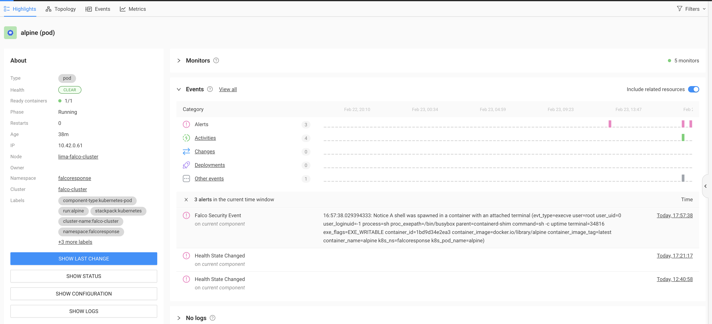

# StackState Event Emitter

[StackState](https://stackstate.com) is full-stack observability platform with tons of extention and integration possibilities.
One of those possibilities is its ability to ingest events from different sources and correllate it onto an event timeline.



The StackState Event Emitter is a container that accepts event configuration via environment variables and sends
the event to a StackState server instance.  The emitter is intended to be used in CI/CD pipelines.

## Usage

Environment variables serve as a means to set up the emitter. The [Common Expression Language](#common-expression-language) 
can be applied within the definition of these variables to dynamically process or retrieve data from the json `BODY` 
environment variable, thereby producing the ultimate value.

| Variable        | Required | CEL Expression | Default       | Description                                                         |
|-----------------|----------|----------------|---------------|---------------------------------------------------------------------|
| BODY            | no       | no             |               | Json data that other parameters can use in their CEL expression     |
| API_URL         | yes      | no             |               | The url to the StackState server                                    |
| API_KEY         | yes      | no             |               | The api key used by the StackState server                           |
| EVT_ORIGIN_HOST | no       | yes            | localhost     | Event originates from host                                          |
| EVT_SOURCE      | no       | no             | emitter       | Event source is the originating system                              |
| EVT_CATEGORY    | no       | yes            | Alerts        | Validate values are Alerts, Activities, Changes, Deployments, Other |
| EVT_TYPE        | no       | yes            | Emitter Event | Type of the event                                                   |
| EVT_TITLE       | yes      | yes            |               | Name of the event                                                   |
| EVT_TEXT        | yes      | yes            |               | Details of the event                                                |
| EVT_IDENTIFIER  | yes      | yes            |               | Identifier of topology target component in StackState               |
| EVT_LINK_TITLE  | no       | yes            |               | Title for the link back to the source system                        |
| EVT_LINK_URL    | no       | yes            |               | URL for the link back to the source system                          |
| EVT_TAGS        | no       | yes            |               | Comma separated list of tags                                        |

### Example usage in Tekton Task

The following is an example 
```yaml

apiVersion: tekton.dev/v1beta1
kind: Task
metadata:
  name: pod-delete
  namespace: falcoresponse
spec:
  params:
    - name: falco-event
      description: The entire msg from falco
  steps:
    - name: pod-delete
      image: ravan/falco-pod-delete-action:0.0.1
      env:
        - name: FALCO_EVENT
          value: $(params.falco-event)
        - name: NAMESPACEWHITELIST
          value: attacker-demo
    - name: send-stackstate-event
      image: ravan/stackstate-event-emitter:0.0.1
      env:
        - name: BODY
          value: $(params.falco-event)
        - name: API_KEY
          valueFrom:
            secretKeyRef:
              name: stackstate-api-properties
              key: API_KEY
        - name: API_URL
          valueFrom:
            secretKeyRef:
              name: stackstate-api-properties
              key: API_URL
        - name: EVT_SOURCE
          value: Tekton
        - name: EVT_TYPE
          value: "'Falco Security Event'"
        - name: EVT_TITLE
          value: "'Falco Tekton threat defender pipeline'"
        - name: EVT_TEXT
          value: >
            'Pod ' + body.output_fields['k8s.pod.name'] + ' in namespace ' + body.output_fields['k8s.ns.name'] + 'was deleted in response to Falco rule "' 
            + body.rule + '". Event '+ body.uuid + ' was triggered from container ' + body.output_fields['container.name']
        - name: EVT_IDENTIFIER
          value: >
            'urn:kubernetes:/falco-cluster:' + body.output_fields['k8s.ns.name'] + ':pod/' + body.output_fields['k8s.pod.name']
       

```


## Common Expression Language
### Language overview

The [CEL
language](https://github.com/google/cel-spec/blob/master/doc/langdef.md) has a
straightforward syntax that is similar to the expressions in C, C++, Java,
JavaScript and Go.

CEL was designed to be embedded into applications. Each CEL "program" is a
single expression that evaluates to a single value. CEL expressions are
typically short "one-liners" that inline well into the string fields like environment variables.

Test expression in the [CEL Playground](https://playcel.undistro.io/)


### CEL options, language features, and libraries

CEL is configured with the following options, libraries and language features:

| CEL option, library or language feature                                                                     | Included                                                                                                                                  |
|-------------------------------------------------------------------------------------------------------------|-------------------------------------------------------------------------------------------------------------------------------------------|
| [Standard macros](https://github.com/google/cel-spec/blob/v0.7.0/doc/langdef.md#macros)                     | `has`, `all`, `exists`, `exists_one`, `map`, `filter`                                                                                     |
| [Standard functions](https://github.com/google/cel-spec/blob/master/doc/langdef.md#list-of-standard-definitions) | See [official list of standard definitions](https://github.com/google/cel-spec/blob/master/doc/langdef.md#list-of-standard-definitions)   |
| [extended strings library](https://pkg.go.dev/github.com/google/cel-go/ext#Strings)                         | `charAt`, `indexOf`, `lastIndexOf`, `lowerAscii`, `upperAscii`, `replace`, `split`, `join`, `substring`, `trim`                           |


## Development

### Prerequisites

- [Taskfile](https://taskfile.dev/installation/)


### Setup environment variables

Set up a `.env` file for configuring the env.

```
USER="<my dockerhub user name>"
PWD="<my dockerhub password>"
```
### Build

```shell
task docker-build
```

### Push

```shell
task docker-push
```

